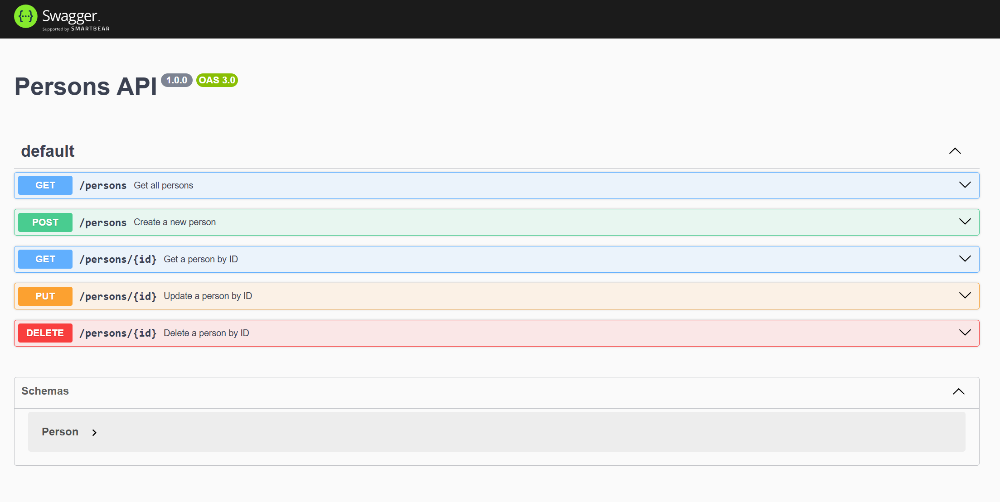

# Connect to and query Azure SQL Database using Node.js and mssql

Learn how to connect to a database in Azure SQL Database and query data using Node.js and mssql npm package.

* [Quickstart in official documentation](https://learn.microsoft.com/azure/azure-sql/database/azure-sql-javascript-mssql-quickstart)

Samples provided include:

* [JavaScript ESM](./js)
* [TypeScript ESM](./ts)
* [Create Azure resource to be used with passwords](./create-resources.sh)
* [Create SQL table](#set-up)

## Set up

1. Create the table in Azure SQL:

    ```sql
    SET ANSI_NULLS ON
    GO
    
    SET QUOTED_IDENTIFIER ON
    GO
    
    CREATE TABLE [dbo].[Person](
    	[id] [int] IDENTITY(1,1) NOT NULL,
    	[firstName] [nvarchar](255) NULL,
    	[lastName] [nvarchar](255) NULL
    PRIMARY KEY CLUSTERED 
    (
    	[id] ASC
    )WITH (STATISTICS_NORECOMPUTE = OFF, IGNORE_DUP_KEY = OFF, OPTIMIZE_FOR_SEQUENTIAL_KEY = OFF) ON [PRIMARY]
    ) ON [PRIMARY]
    
    GO
    
    INSERT INTO [dbo].[Person]
               ([firstName]
               ,[lastName])
         VALUES
               ('Willam'
               ,'Jones')
    GO
    ```
    

1. Install dependencies: 

    ```
    npm install
    ```

1. Create `.env.development` and set the environment variables:

   ```
    AZURE_SQL_SERVER=<YOURSERVERNAME>.database.windows.net
    AZURE_SQL_DATABASE=<YOURDATABASENAME>
    AZURE_SQL_PORT=1433
    # Passwordless
    # AZURE_SQL_AUTHENTICATIONTYPE=azure-active-directory-default
    # With password
    AZURE_SQL_USER=<YOURUSERNAME>
    AZURE_SQL_PASSWORD=<YOURPASSWORD>   
   ```

1. In `person.js`, verify or set which configuration you want:

    * `const config = noPasswordConfig;`
    * `const config = passwordConfig;`

1. In `index.js`, verify or set which configuration you want:

    * `const database = new Database(noPasswordConfig);`
    * `const database = new Database(passwordConfig);`
    
    

1. Start the app:

    ```
    NODE_ENV=development node index.js
    ```

    